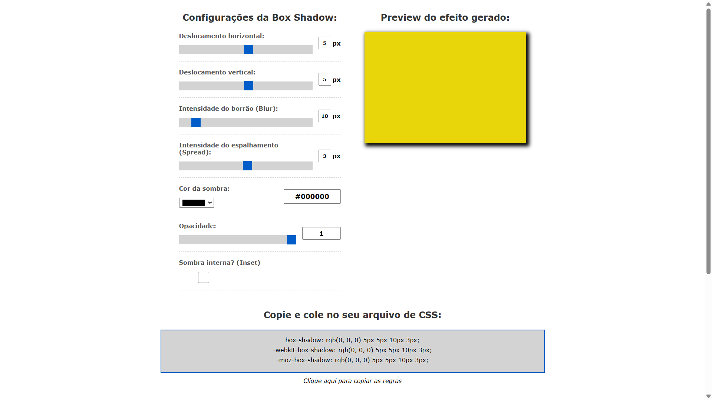

# Gerador-de-box-shadow-com-JavaScript

[](https://wakatime.com/badge/user/268de5b9-4dbd-4873-9ede-a165e5745754/project/70693fc0-c377-471e-b887-98884db826cc)

Projeto utilitário pode utilizar para criar uma box shadow com um auxílio gráfico permitindo ver a regra gerada de forma simples.

[Click para visualizar](https://gerador-de-box-shadow.netlify.app/)



# Box Shadow Generator

## Descrição

O **Box Shadow Generator** é uma ferramenta interativa para criar sombras em elementos CSS de forma intuitiva. Com este gerador, é possível ajustar diversos parâmetros da sombra, visualizar o resultado em tempo real e copiar o código CSS gerado para uso imediato.

## Recursos

- Ajuste de deslocamento horizontal e vertical da sombra
- Controle da intensidade do desfoque (blur)
- Controle da expansão da sombra (spread)
- Escolha da cor da sombra
- Ajuste da opacidade da sombra
- Opção de ativar/desativar o modo `inset`
- Código CSS gerado automaticamente para `box-shadow`, `-webkit-box-shadow` e `-moz-box-shadow`
- Botão para copiar o código gerado

## Tecnologias Utilizadas

- **HTML**: Estrutura da interface do usuário
- **CSS**: Estilização da aplicação
- **JavaScript**: Manipulação dinâmica dos elementos e geração do código CSS

## Como Usar

1. Clone este repositório ou faça o download dos arquivos.
2. Abra o arquivo `index.html` em um navegador.
3. Utilize os controles para ajustar os parâmetros da sombra.
4. Copie o código CSS gerado e utilize em seu projeto.

## Exemplo de Uso

```css
box-shadow: 10px 10px 20px 5px rgba(0, 0, 0, 0.5);
-webkit-box-shadow: 10px 10px 20px 5px rgba(0, 0, 0, 0.5);
-moz-box-shadow: 10px 10px 20px 5px rgba(0, 0, 0, 0.5);
```

## Contribuição

Fique à vontade para contribuir com melhorias ou relatar problemas no projeto.

## Licença

Este projeto está licenciado sob a [MIT License](LICENSE).
